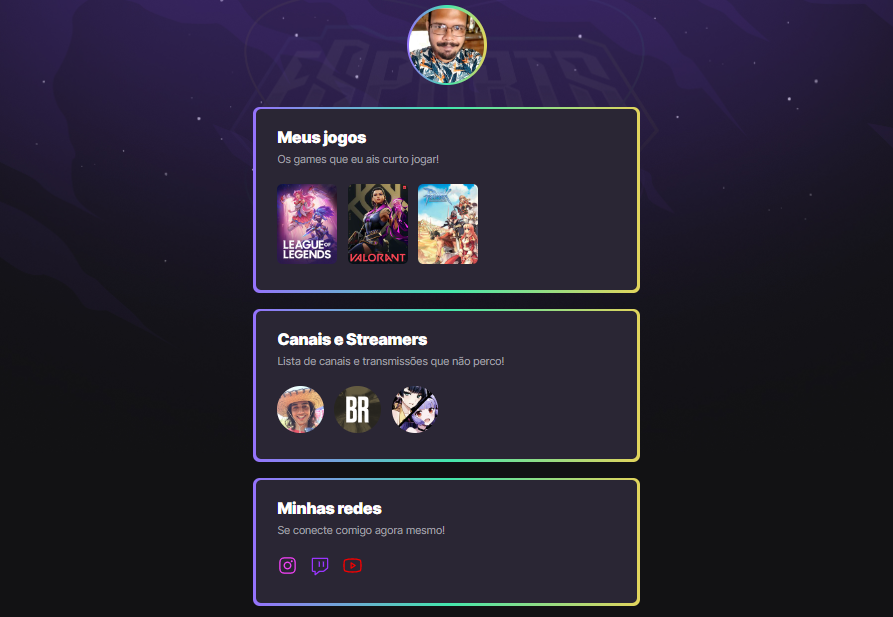

# Projeto desenvolvido na Next Level Week eSports da Rocketseat
## Trilha Explorer

➡️ [Clique aqui para acessar](https://dersoaguiar.github.io/NLW---E-sports/)

### 🛠️ Tecnologias 👨🏾‍💻
O projeto foi desenvolvido com a orientação do Mayk Brito (https://www.linkedin.com/in/maykbrito/) e essas foram as tecnologias utilizadas:
 
- HTML5;
- CSS 3;
- Git;
- Github;